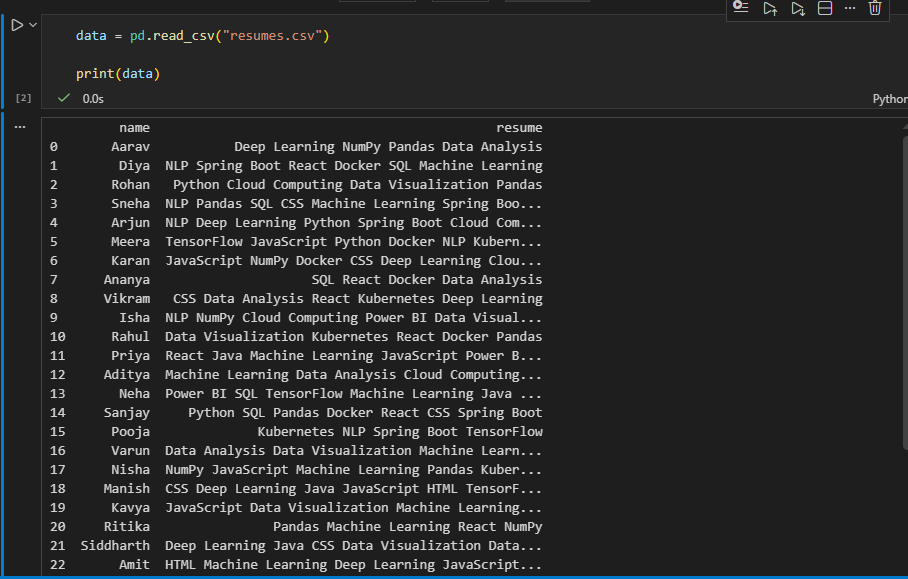
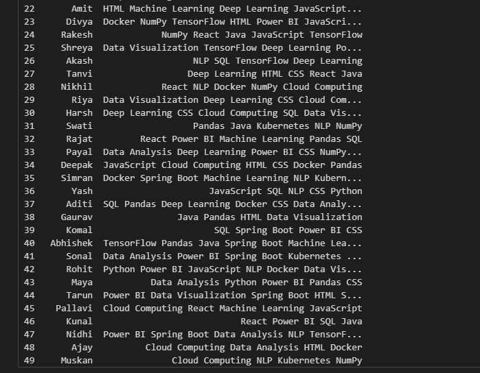
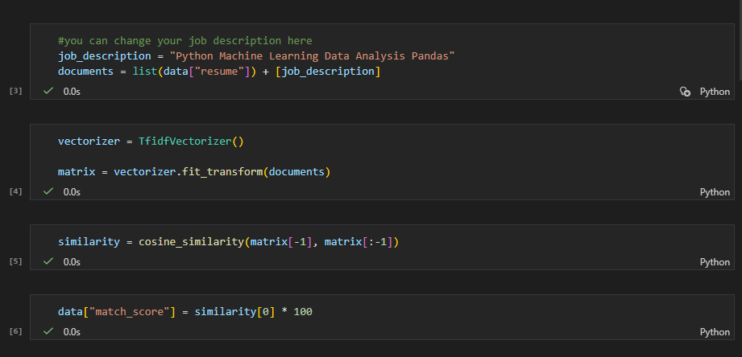
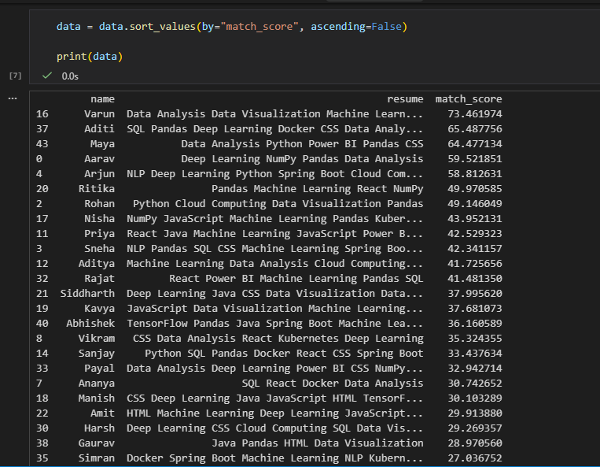
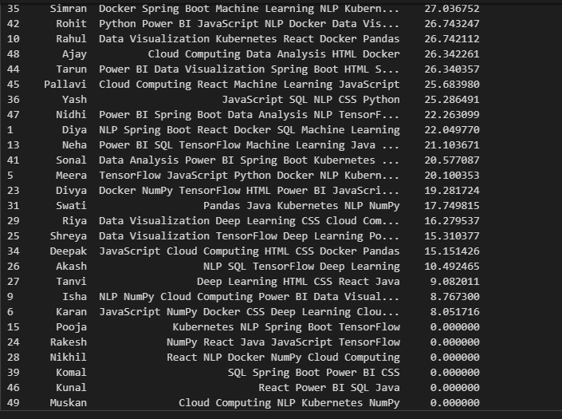
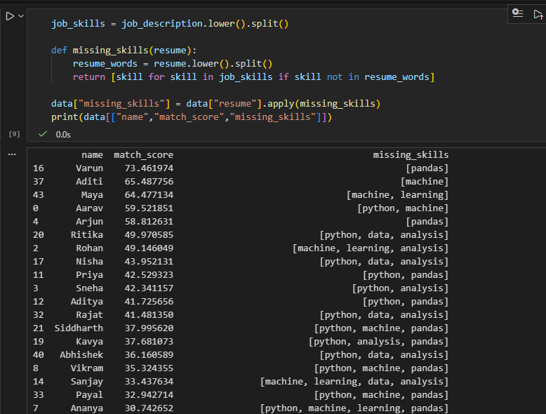
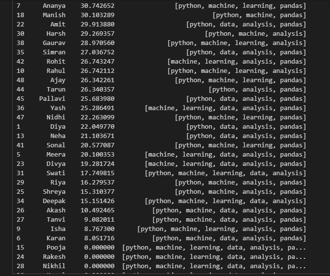
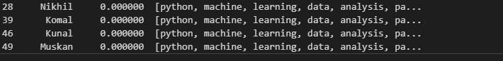

# Resume / Candidate Screening System (Machine Learning)

## Project Overview

This project builds a **Machine Learning based Resume Screening System** that helps companies automatically analyze resumes and rank candidates based on how well their skills match a given job description.

The system uses **Natural Language Processing (NLP)** techniques to convert resume text into numerical features and compares them with job requirements to determine the best candidates.

---

## Objectives

* Automatically analyze resumes
* Extract and compare candidate skills
* Rank candidates based on job match
* Identify missing skills required for the role

---

## Technologies Used

* Python
* Pandas
* Scikit-learn
* TF-IDF Vectorization
* Cosine Similarity

---

## Project Workflow

### 1. Data Loading

The system loads resume data from a dataset containing candidate names and their skills.

### 2. Job Description Input

A job description containing required skills is defined for the role.

### 3. Text Processing

Resume text and job description are processed and converted into numerical vectors using **TF-IDF Vectorization**.

### 4. Similarity Calculation

The similarity between each resume and the job description is calculated using **Cosine Similarity**.

### 5. Candidate Ranking

Candidates are ranked based on their **match score**.

### 6. Missing Skills Detection

The system identifies skills that candidates lack compared to the job requirements.

---

## Screenshots

### Dataset Preview

### TF-IDF Vectorization

### Similarity Calculation

### Candidate Ranking

### Missing Skills Detection

---

## Conclusion

This project demonstrates how Machine Learning and Natural Language Processing can be used to automate resume screening and help recruiters identify the most suitable candidates quickly and efficiently.
